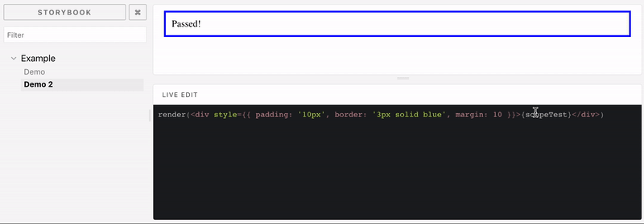

# storybook-addon-react-live-edit



## Installation
```bash
yarn add -D storybook-addon-react-live-edit
```

### Configure storybook
To get this addon in your story book you have to register the panel, `addLiveSource` story creator
 and optionally add a scope decorator to make additional components and utilities available in live editor scope 
 
#### Register the panel
Add to .storybook/addons.js 
```javascript
import 'storybook-addon-react-live-edit/dist/register';
```
 
#### Register the `addLiveSource` story creator
Add to .storybook/config.js 
```javascript
import {setAddon} from '@storybook/react';
import LiveEdit, {setOptions} from 'storybook-addon-react-live-edit';

setOptions({ theme: 'darcula', presets: ['react'] });

setAddon(LiveEdit);
```

#### Add `withLiveEditScope` story decorator
addDecorator to .storybook/config.js
```javascript
import {addDecorator} from '@storybook/react';
import {withLiveEditScope} from 'storybook-addon-react-live-edit';

import ExternalComponent from 'a-apackage';

addDecorator(withLiveEditScope({ ExternalComponent }));
```

> or

addDecorator to particular stories 

```javascript
import {withLiveEditScope} from 'storybook-addon-react-live-edit';
import ExternalComponent from 'a-apackage';

storiesOf("Demo", module)
  .addDecorator(withLiveEditScope({ ExternalComponent }))
  .addLiveSource('demo', `return <div>{scopeTest}</div>`);
```

## Usage
When LiveEdit addon is registered with storybooks `setAddon` function new method `addLiveSource` 
to add a story from source provided as a string. This source can be edited in "Live edit" panel
```javascript
storiesOf("Demo", module)
  .addLiveSource('demo', `return <div>{scopeTest}</div>`);
```

> or

You can use `withLiveEdit` story creator
```javascript
storiesOf("Demo", module)
  .add('demo', withLiveEdit( React, `return <div>{scopeTest}</div>`));
```


## API

### `addLiveSource`
```
addLiveSource(name, source[, scope]) 
```
- `name` (string, required) - the story name
- `source` (string, required) - story source to be rendered in preview and 
  available for editing in "Live edit" panel
- `scope` (object, optional) - variables provided to rendered story, 
  these can be additional components, utilities or any other data.
  Scope is merged with all variables previously provided 
  by `withLiveEditScope` decorators.


### `withLiveEdit`
```
withLiveEdit(source[, scope]) 
```
- `source` (string, required) - story source to be rendered in preview and 
  available for editing in "Live edit" panel
- `scope` (object, optional) - variables provided to rendered story, 
  these can be additional components, utilities or any other data.
  Scope is merged with all variables previously provided 
  by `withLiveEditScope` decorators.

### `withLiveEditScope` decorator
```
withLiveEditScope(scope)
```
- `scope` (object, required) - variables provided to rendered story, 
  these can be additional components, utilities or any other data.
  Scope is merged with all variables previously provided 
  by `withLiveEditScope` decorators. React should be imported and provided within the scope object.


## Example
To run provided example execute following command, storybook will run on port 3000
```bash
yarn example
```
